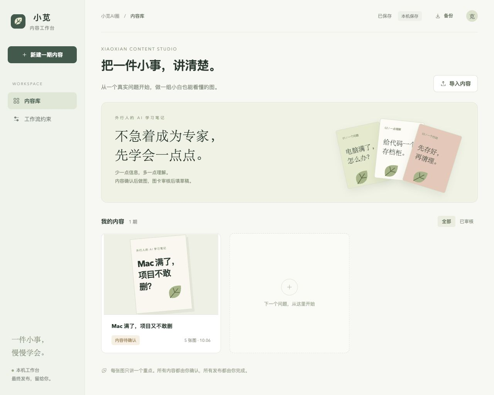
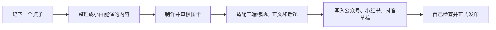
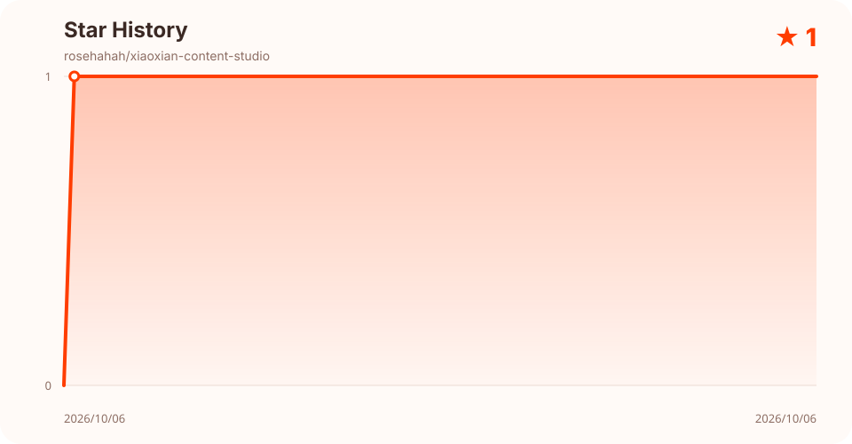

# 小苋内容工作台 · Xiaoxian Content Studio

[](LICENSE)
[](package.json)
[](https://github.com/rosehahah/xiaoxian-content-studio/actions/workflows/ci.yml)
[](https://github.com/rosehahah/xiaoxian-content-studio/stargazers)
[](#contributors-)

一个给个人创作者使用的本机内容工作台：灵感来了先记下来，一次整理成内容和图卡，再分别写入微信公众号、小红书和抖音草稿。最后检查和正式发布，仍然由你自己完成。



## 为什么我做它

我自己就是一个同时维护微信公众号、小红书和抖音的博主。

很多内容最开始只是突然冒出来的一个点子。如果当时没有赶紧记下来、整理出来，过几个小时可能就没有感觉了。但真正准备发布时，我又要反复做这些事情：重新组织文字、制作图卡、改三套标题和说明、检查各平台字数，再去三个创作中心重复上传和粘贴。

灵感可能只花一分钟，后面的搬运却要花很久。事情一多，原本想讲的内容就很容易被拖掉。

所以我做了这个工作台，希望把最麻烦的重复劳动接起来：**我只需要先抓住那个点子，系统帮助我把它推进到三个平台的草稿箱；最终发不发、什么时候发，仍然由我决定。**

## 一个点子怎样变成三端草稿



这里的每一步只负责自己的事情：内容没确认，不进入制图；图卡没审核，不进入平台草稿；平台草稿写好后，系统停在发布按钮之前。

## 它主要替我省掉什么

- 一个灵感只整理一次，不必在三个平台重新从头写。
- 一套审核后的图卡可以继续用于三端，不再反复导出、找图和上传。
- 自动适配不同平台的标题、正文字数和话题数量。
- 登录状态提前检查，准备好后再自动填写创作中心。
- 所有内容先进入草稿箱，保留最后一次人工检查。

它适合同时经营多个内容平台的个人博主、个人 IP 和小团队，尤其适合“点子很多，但容易卡在整理与发布流程”的创作者。

## 能力

- 自由编排的 1080 × 1440 HTML 图卡，可导出 PNG 与交付 ZIP。
- 内容确认、逐图审核、版本指纹和上游修改失效机制。
- Lucide 与 Tabler 共 8,104 个本机 SVG 素材，支持中文同义词搜索。
- 微信公众号草稿接口，以及小红书、抖音的本机浏览器草稿自动化。
- 小红书和抖音先校验独立浏览器登录状态，再开放自动填写。
- 只填写草稿；代码没有正式发布端点，浏览器脚本不点击“发布”。

## 本机启动

需要 Node.js 20+ 和 Google Chrome。

```sh
npm install
npm run build
npm start
```

打开 <http://localhost:4318>。服务只绑定 `127.0.0.1`，不会开放到局域网。macOS 也可以双击 `启动小苋工作台.command`。

本机数据保存在 `.local-data/`，该目录已加入 `.gitignore`：

- `projects.json`：项目内容与审核记录
- `browser-profiles/`：小红书、抖音的独立 Chrome 登录会话
- `draft-jobs/`：草稿任务状态

项目不会读取或导出平台密码。公众号凭证从本机环境读取，不进入网页、项目 JSON 或 Git 仓库。

## 工作流

1. **内容**：明确主题、读者收益、事实和必要解释。
2. **图卡**：选择编排、配色和素材，实际导出检查裁切与可读性。
3. **审核**：用户逐张检查，确认最终成图。
4. **草稿**：适配各平台标题、说明和话题，写入草稿或下载交付包。

更完整的职责、确认和失效条件见 [WORKFLOW.md](WORKFLOW.md)。项目内 Agent Skills 位于 [.agents/skills](.agents/skills)，创作方法和研究取舍见 [research/创作方法研究.md](research/创作方法研究.md)。

## 平台边界

- **微信公众号**：调用现有本机草稿接口，只创建和读回草稿。
- **小红书 / 抖音**：使用 Playwright 打开独立 Chrome，上传审核图片并填写标题、正文和话题。会话失效、验证码或页面结构变化时停止并交给用户。
- **所有平台**：没有自动发布功能。

平台页面会变化，浏览器自动化应视为可维护的适配器，而不是平台官方 API。使用者需要遵守对应平台条款。

## 开发与验证

```sh
npm run build
npm test
```

测试覆盖审核约束、版本冲突、同源限制、平台字数、自动草稿状态和正式发布端点缺失。测试使用隔离数据和模拟草稿驱动，不调用内容平台远程接口。

## 开源、致谢与贡献者

项目代码、文档和项目内原创 Skills 使用 [Apache License 2.0](LICENSE)。选择它是因为它允许复用与商用，同时包含明确的专利授权、变更说明和贡献条款。

“小苋AI圈”名称、Logo、人物照片和个人形象不在 Apache-2.0 授权范围内，详见 [BRAND.md](BRAND.md)。第三方项目、Agent Skills 和运行时依赖的作者与许可证记录在 [ACKNOWLEDGEMENTS.md](ACKNOWLEDGEMENTS.md) 和 [THIRD_PARTY_NOTICES.md](THIRD_PARTY_NOTICES.md)。

本项目采用 [All Contributors](https://allcontributors.org/en/reference/specification/) 规范，同时承认代码、内容方法、设计思路和工具贡献。GitHub 内置 Contributors 图表仍只反映真实 commit；下方表格展示更完整的贡献类型。提交代码、设计、文档、测试或研究都欢迎，参见 [CONTRIBUTING.md](CONTRIBUTING.md)。

## Contributors ✨

感谢这些创作者、维护者和组织为项目提供代码、内容方法、设计思路或工具。每个符号的含义见 [贡献类型说明](https://allcontributors.org/en/reference/emoji-key/)，具体采用范围和许可证见 [ACKNOWLEDGEMENTS.md](ACKNOWLEDGEMENTS.md)。

<!-- ALL-CONTRIBUTORS-LIST:START - Do not remove or modify this section -->
<table>
  <tr>
    <td align="center" valign="top" width="20%"><a href="https://github.com/rosehahah"><br /><sub><b>Rose Han</b></sub></a><br /><a href="https://allcontributors.org/en/reference/emoji-key/#code" title="Code">💻</a> <a href="https://allcontributors.org/en/reference/emoji-key/#design" title="Design">🎨</a> <a href="https://allcontributors.org/en/reference/emoji-key/#content" title="Content">🖋</a> <a href="https://allcontributors.org/en/reference/emoji-key/#doc" title="Documentation">📖</a> <a href="https://allcontributors.org/en/reference/emoji-key/#maintenance" title="Maintenance">🚧</a></td>
    <td align="center" valign="top" width="20%"><a href="https://github.com/op7418"><br /><sub><b>歸藏</b></sub></a><br /><a href="https://allcontributors.org/en/reference/emoji-key/#ideas" title="Ideas & Planning">🤔</a> <a href="https://allcontributors.org/en/reference/emoji-key/#design" title="Design">🎨</a> <a href="https://allcontributors.org/en/reference/emoji-key/#content" title="Content">🖋</a></td>
    <td align="center" valign="top" width="20%"><a href="https://github.com/whitthose"><br /><sub><b>whitthose</b></sub></a><br /><a href="https://allcontributors.org/en/reference/emoji-key/#ideas" title="Ideas & Planning">🤔</a> <a href="https://allcontributors.org/en/reference/emoji-key/#content" title="Content">🖋</a></td>
    <td align="center" valign="top" width="20%"><a href="https://github.com/adjfks"><br /><sub><b>corner</b></sub></a><br /><a href="https://allcontributors.org/en/reference/emoji-key/#ideas" title="Ideas & Planning">🤔</a> <a href="https://allcontributors.org/en/reference/emoji-key/#content" title="Content">🖋</a></td>
    <td align="center" valign="top" width="20%"><a href="https://github.com/classfang"><br /><sub><b>Junki</b></sub></a><br /><a href="https://allcontributors.org/en/reference/emoji-key/#ideas" title="Ideas & Planning">🤔</a> <a href="https://allcontributors.org/en/reference/emoji-key/#content" title="Content">🖋</a></td>
  </tr>
  <tr>
    <td align="center" valign="top" width="20%"><a href="https://github.com/aaron-he-zhu"><br /><sub><b>Aaron Zhu</b></sub></a><br /><a href="https://allcontributors.org/en/reference/emoji-key/#ideas" title="Ideas & Planning">🤔</a> <a href="https://allcontributors.org/en/reference/emoji-key/#content" title="Content">🖋</a></td>
    <td align="center" valign="top" width="20%"><a href="https://github.com/nashsu"><br /><sub><b>nash_su</b></sub></a><br /><a href="https://allcontributors.org/en/reference/emoji-key/#ideas" title="Ideas & Planning">🤔</a> <a href="https://allcontributors.org/en/reference/emoji-key/#content" title="Content">🖋</a></td>
    <td align="center" valign="top" width="20%"><a href="https://github.com/anthropics"><br /><sub><b>Anthropic</b></sub></a><br /><a href="https://allcontributors.org/en/reference/emoji-key/#ideas" title="Ideas & Planning">🤔</a> <a href="https://allcontributors.org/en/reference/emoji-key/#design" title="Design">🎨</a></td>
    <td align="center" valign="top" width="20%"><a href="https://github.com/nextlevelbuilder"><br /><sub><b>Next Level Builder</b></sub></a><br /><a href="https://allcontributors.org/en/reference/emoji-key/#ideas" title="Ideas & Planning">🤔</a> <a href="https://allcontributors.org/en/reference/emoji-key/#design" title="Design">🎨</a></td>
  </tr>
</table>

<!-- ALL-CONTRIBUTORS-LIST:END -->

## Star History

星标曲线从 GitHub 读取后在本机生成，不会把访问令牌交给第三方服务。维护者可运行 `npm run star-history` 刷新明暗两版 SVG。

<p align="center">
  <picture>
    <source media="(prefers-color-scheme: dark)" srcset="assets/star-history-dark.svg" />
    
  </picture>
</p>

## License

Copyright 2026 Xiaoxian AI Circle contributors.

Licensed under the Apache License, Version 2.0. See [LICENSE](LICENSE) and [NOTICE](NOTICE).

## 联系小苋

项目使用、内容创作或合作交流，可以扫码添加小苋企业微信。

<p align="center">
  
</p>
